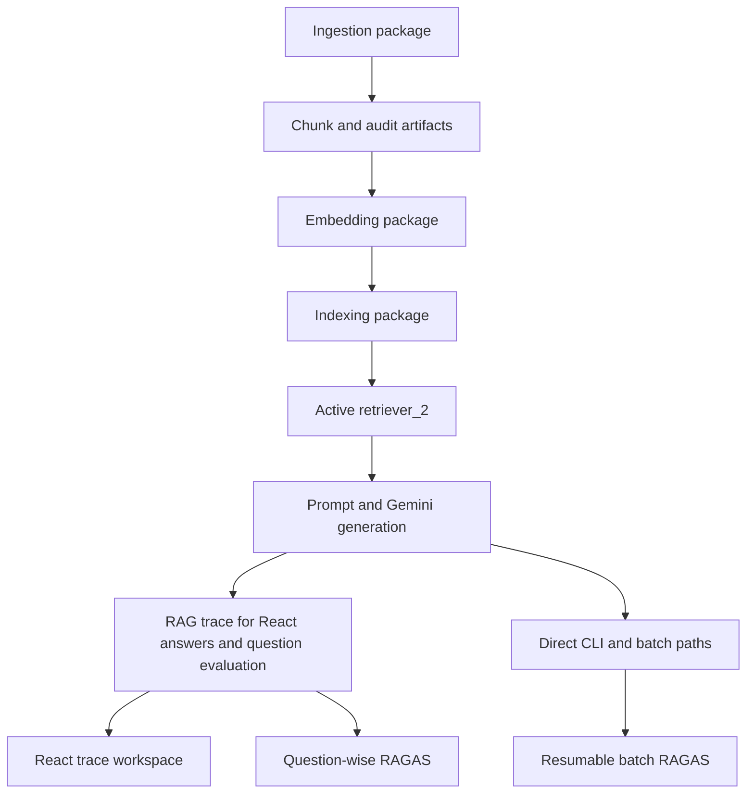

# Architecture Reference

This document records the current implementation at a deeper level than `README.md`. Paths, symbols, models, defaults, and boundaries were verified against the source at commit `bbedb9d53e835971ccc5e4d165866b23672a5834`. Re-verify affected source before changing behavior.

## System map



## A. Ingestion

### Orchestration boundary

The canonical entry point is `multimodal_rag.ingestion.pipeline.orchestrator.ingest_document()` and the CLI is `multimodal_rag.cli.ingest.main()`.

`OrchestratorConfig` composes the stage-specific configuration objects:

- `PreAnalyzerConfig`
- `LayoutSegmenterConfig`
- `OCRConfig`
- `VisionDescriberConfig`
- `CleaningConfig`
- `ValidationConfig`
- `ChunkerConfig`
- output, layout-analysis, and routing configurations

Whole-document failures are wrapped as `IngestionError`. Region failures are normally retained as validation/audit results rather than aborting the document.

### Loader

Module: `packages/ingestion/src/multimodal_rag/ingestion/loaders/pdf_loader.py`

Public function: `load_pdf()`

Responsibilities:

- Validate existence, nonzero size, maximum size (200 MB default), encryption, corruption, and page-count bounds (1-2000).
- Use PyMuPDF to capture 1-indexed page numbers, page dimensions, raw text, font spans, embedded-image bounds, and vector drawing counts.
- Mark font spans containing `(cid:...)`, `/gid...`-style tokens, replacement characters, or excessive private-use characters as suspicious.
- Retain a failed page as an empty `RawPage` with `extraction_error` so one bad page does not automatically discard the whole document.

The loader reports raw signals; it does not make extraction-routing decisions.

### Page pre-analysis

Module: `packages/ingestion/src/multimodal_rag/ingestion/analysis/page_preanalyzer.py`

Core symbols: `PreAnalyzerConfig`, `PageAnalysis`, `analyze_page()`, `analyze_document()`

Signals include:

- Text character count
- Image-area ratio
- Table/vector hints
- CID/broken-font suspect ratio
- Scan candidacy
- Multi-column indication

A page is a scan candidate only when low native text and high image area coincide. A broken-font page or scan candidate makes the native layer untrusted downstream. `PreAnalyzerConfig.load()` reads `config/preanalyzer_config.json` when present and otherwise uses defaults.

### Layout segmentation

Module: `packages/ingestion/src/multimodal_rag/ingestion/analysis/layout_segmenter.py`

Core symbols: `Region`, `TableData`, `LayoutSegmenterConfig`, `segment_document()`

Docling provides typed regions, bounding boxes, coordinate origin, reading order, native text, structured tables, and picture references. The implementation:

- Enables picture-image generation and saves figure images by default.
- Uses Docling's accurate table-structure mode by default.
- Uses automatic accelerator selection with four threads.
- Processes documents in batches of 10 pages to bound native/model memory.
- Converts Docling table cells/spans into an internal row grid and Markdown.
- Runs a PyMuPDF native-text completeness comparison after Docling extraction.
- Replaces non-table regions when Docling found under 5% of available native text.
- Supplements, rather than replaces, regions when Docling found at least 5% but less than 30%.
- Optionally uses pdfplumber to recover tables of at least 2 x 2 where Docling found no table region.

The supplement path may duplicate content and appends its recovered block at the end of the page. This is an explicit recall-over-perfect-order trade-off.

### Layout analysis

Module: `packages/ingestion/src/multimodal_rag/ingestion/analysis/layout_analysis.py`

Core symbols: `LayoutAnalysisConfig`, `LayoutAnalysis`, `build_layout_analysis()`

The module computes region-type counts, density, average text length, fragmentation, bounding-box alignment, and a composite infographic score. Fragmentation and alignment have equal default weight (`0.5` each). It measures structure but never chooses an extractor.

### Routing policy

Module: `packages/ingestion/src/multimodal_rag/ingestion/routing/routing_policy.py`

Core symbols: `RoutingPolicyConfig`, `PageRoutingDecision`, `decide_page_routing()`

Defaults:

- `infographic_score_threshold = 0.6`
- `ocr_grounds_gemini = True`

`PageRoutingDecision` has independent `use_native`, `use_ocr`, and `use_gemini` flags plus reasons. Behavior:

- Native is enabled when the page is not a scan candidate and has no broken-font signal.
- OCR is enabled when native is untrusted.
- Gemini is enabled when the page's infographic score meets the threshold.
- When an infographic page still has trusted native text, OCR can also be enabled to provide exact wording around the Vision path.

The policy performs no extraction and no content-quality validation.

### OCR and Vision extraction

OCR module: `packages/ingestion/src/multimodal_rag/ingestion/extractors/ocr_extractor.py`

- `OCRConfig.deskew_enabled` defaults to `False` after local measurements showed interpolation could reduce confidence.
- `run_ocr()` returns line text, bounding quadrilaterals, line confidences, mean confidence, deskew metadata, and notes.
- No detected text is a valid empty result; engine failure raises `OCRExtractionError`.

Vision module: `packages/ingestion/src/multimodal_rag/ingestion/extractors/vision_describer.py`

- Model: `gemini-3.1-flash-lite`.
- `DecorativeImageRegistry` uses average-hash recurrence across at least three distinct pages with Hamming distance at most four.
- Non-decorative figures are OCRed first.
- OCR text with at least 15 characters and mean confidence at least `0.75` is used directly, regardless of edge density.
- Weak/empty OCR escalates to `describe_diagram_image()` when `GEMINI_API_KEY` is available.
- Missing/failing Vision returns whatever OCR text exists and records the reason.

Gemini Vision therefore receives a rendered image only on an escalated path. It is not called for every PDF page or every figure.

### Validation and fallback

Module: `packages/ingestion/src/multimodal_rag/ingestion/processing/validator.py`

Core symbols: `ValidationConfig`, `ValidatedRegionResult`, `validate_region()`, `validate_table_region()`, `validate_figure_region()`

Defaults:

- OCR accepted threshold: `0.6`
- OCR failed threshold: `0.3`
- Minimum meaningful-character ratio: `0.4`
- Region-render DPI: `200`

Text-like regions:

1. Clean and validate native text when trusted.
2. If native is rejected/untrusted, render the region and run OCR.
3. Mark OCR as `ok`, `low_confidence`, or `failed` from confidence/content checks.
4. Escalate to Vision when OCR failed or the page routing decision explicitly requests Gemini.

Tables:

1. Validate the Docling grid and cell readability.
2. OCR the table bounding box if the grid is absent/unreadable or Vision is requested.
3. Accept sufficient OCR as `low_confidence` because row/column structure was lost.
4. Escalate to the existing figure/Vision pipeline when OCR is insufficient or page routing requests Vision.

Figures:

- Decorative images are explicitly recorded as skipped.
- Confident OCR or a Vision description is `ok`.
- OCR fallback after unavailable Vision is `low_confidence` when text exists.
- No description and no OCR text is `failed`.

Every `ValidatedRegionResult` retains the attempted methods, chosen method, status, failure reason, confidence, and notes.

### Cleaner

Module: `packages/ingestion/src/multimodal_rag/ingestion/processing/cleaner.py`

`clean_text()` applies Unicode/text cleanup through a config-driven pipeline and returns both final text and a list of applied fixes. Cleaning is used before validation decisions and before chunks are emitted.

### Structure-aware chunking

Module: `packages/ingestion/src/multimodal_rag/ingestion/processing/chunker.py`

Core symbols: `ChunkerConfig`, `ChunkMetadata`, `Chunk`, `chunk_document()`

Defaults:

- `chunk_size = 1000`
- `chunk_overlap = 150`
- `max_table_chunk_chars = 2000`
- `table_rows_per_split = 15`

Important behavior:

- Heading runs construct section titles; heading state is reset or inherited according to page-boundary rules.
- Regular paragraph-like regions in a section/page are combined and split with `RecursiveCharacterTextSplitter`.
- Heading prefixes are added after splitting so every resulting chunk retains section context.
- Content is not merged across page boundaries.
- Tables and figures are isolated structural chunks; oversized tables split by row groups.
- Failed or empty validated regions are returned as `unrecoverable` and do not enter the vector corpus.

`ChunkMetadata` contains:

- `chunk_id`, `document_id`, `source_file`
- `page_numbers`, `section_title`, `layout_type`
- `extraction_method`, `ocr_confidence`, `validation_status`
- `ingestion_timestamp`, `pipeline_version`
- optional `table_reference`, `image_reference`
- `source_region_ids`

### Ingestion outputs

Modules:

- `ingestion/output/raw_writer.py`
- `ingestion/output/writer.py`
- `ingestion/output/human_readable_writer.py`

Per-document files under `runtime-data/artifacts/ingestion/<document_id>/`:

```text
raw/raw_text.txt
raw/pages.json
raw/tables.json
raw/metadata.json
chunks.json
metadata.json
validation_report.json
extracted_text_audit.md
human_readable_extraction.md
tables/<region_id>.json
```

The raw snapshot is written immediately after layout segmentation, before cleaning/OCR/Vision/validation. Final JSON and Markdown files expose accepted chunks and full validation history independently.

### Current ingestion technical debt

`orchestrator.py` adds a page-level Gemini summary for hard-coded pages `{21, 28, 32, 34}` alongside normal per-region output. `_PAGE_LEVEL_GEMINI_PAGES` is explicitly labeled a POC/TODO and should become a routing-derived signal. Debug `print()` blocks for those pages also remain in validator/chunker code and should be reviewed separately rather than removed during unrelated work.

## B. Embedding and indexing

### Embedding

Module: `packages/rag-core/src/multimodal_rag/rag/embedding/embedder.py`

Core symbols: `EmbeddingConfig`, `EmbeddingResult`, `embed_document()`, `embed_chunks()`, `write_embeddings()`

Defaults:

- Model: `gemini-embedding-2`
- Dimension: 768 by default (configurable to 1536 or 3072)
- Device: `auto`
- Batch size: `32`
- Normalize: `True`
- Minimum raw chunk characters: `3`
- Heading-only effective-body threshold: `15`

`_get_model()` lazily constructs one module-level Gemini client singleton per API key. `_embed_texts()` sends separate `Content` objects to `models.embed_content`, applies the Gemini search-query/document prefixes, requests the configured output dimension, and preserves normalized NumPy output.

`write_embeddings()` creates:

- `embeddings.npy` — `float32` matrix
- `embeddings_metadata.json` — model, dimension, embedded/skipped counts, chunk-to-row mapping, full text, and skip reasons

A fresh machine must provision this exact model into the local Hugging Face cache before the normal offline path can run.

### FAISS

Module: `packages/rag-core/src/multimodal_rag/rag/indexing/faiss_index.py`

Core symbols: `IndexConfig`, `IndexedChunkRef`, `build_index_from_output_dir()`, `save_index()`, `load_index()`, `search()`

Index structure:

```text
IndexIDMap2
`-- IndexFlatIP(d=768 by default)
```

Normalized embedding inner product equals cosine similarity. The builder concatenates every valid `embeddings.npy` / `embeddings_metadata.json` pair, assigns sequential integer IDs, and writes:

- `runtime-data/artifacts/index/faiss_index.bin`
- `runtime-data/artifacts/index/id_map.json`

FAISS stores vectors and integer IDs; `id_map.json` restores `chunk_id`, document/source identity, pages, section, and text. `load_index()` requires both files. `search()` preserves FAISS ordering, ignores `-1` padding, and returns `(IndexedChunkRef, float_score)` pairs.

## C. Retrieval

Module: `packages/rag-core/src/multimodal_rag/rag/retrieval/retriever_2.py`

Core symbols: `RetrievedChunk`, `RetrieverConfig`, `retrieve()`

This is the sole maintained production retriever; the inactive `retriever.py` was deleted after reference and behavior audits.

Defaults:

- `RetrieverConfig.top_k = 5` (caller overrides determine production behavior)
- `min_score = 0.0`
- `lexical_rerank_weight = 0.15`

### Candidate and ranking flow

1. Strip and embed the query through `EmbeddingConfig` and `_embed_texts()`.
2. Ask FAISS for exactly `top_k` candidates.
3. Tokenize the query and each candidate with `[a-z0-9-]+`, lowercase them, and remove the fixed stopword set.
4. Compute query-normalized overlap:

   ```text
   lexical_overlap = len(query_tokens & chunk_tokens) / len(query_tokens)
   ```

   It is `0.0` when `query_tokens` is empty.

5. Compute, for every candidate:

   ```text
   combined_rerank_score = raw_faiss_score + 0.15 * lexical_overlap
   ```

6. Sort descending by the combined value when the lexical weight is nonzero.
7. Filter with `raw_faiss_score >= min_score`.
8. Return `RetrievedChunk` objects in final order.

`RetrievedChunk.score` remains the raw FAISS value for compatibility. `combined_rerank_score` is an optional final dataclass field, allowing older construction sites to omit it. Disabling reranking sets the combined value equal to the raw score and preserves original FAISS order.

### Caller-specific top-k

| Caller | Construction | Top-k |
|---|---|---:|
| CLI ask | `--top-k`, default | 8 |
| Question-wise evaluation | `question_runner.CONFIGURED_TOP_K` | 8 |
| Batch evaluation | explicit `RetrieverConfig(top_k=8)` | 8 |

The lexical stage only reorders the dense candidate set. It cannot recover a relevant chunk that FAISS placed outside the requested top-k. No deduplication, MMR, cross-encoder, BM25, query rewriting, or metadata filter is active.

### Metadata enrichment

`rag.trace.load_chunk_metadata()` recursively reads existing ingestion `chunks.json` files and maps `metadata.chunk_id` to the complete metadata dictionary. Conflicting metadata records mark an ID ambiguous; missing or ambiguous metadata is labeled unavailable rather than guessed.

## D. Generation

### Prompt construction

Module: `packages/rag-core/src/multimodal_rag/rag/generation/prompt_builder.py`

Core symbols: `ConversationTurn`, `BuiltPrompt`, `build_prompt()`

Each ranked chunk becomes a source block:

```text
[S1] (source: <file>, page(s): <pages>)
<complete chunk text>
```

Source markers follow final retrieval order. The prompt tells Gemini to answer only from sources, prioritize S1 when sufficient, avoid unrelated lower-ranked content, use clear headings/bullets, and state when evidence is insufficient.

The prompt builder supports bounded conversation history for callers that need
follow-up resolution. CLI and evaluation use the latest question alone.

The current prompt explicitly tells the model not to mention source markers/page numbers/citations in its answer. Therefore resolved markers are opportunistic rather than guaranteed.

### Gemini adapter

Module: `packages/rag-core/src/multimodal_rag/rag/generation/answer_generator.py`

Core symbols: `GenerationConfig`, `GenerationResult`, `generate_answer_with_metadata()`, `generate_answer()`

Defaults:

- Model: `gemini-3.1-flash-lite`
- Temperature: `0.2`

`generate_answer_with_metadata()` makes exactly one `google.genai.Client.models.generate_content()` request and returns:

- `text`
- `prompt_tokens` from `usage_metadata.prompt_token_count`
- `completion_tokens` from `usage_metadata.candidates_token_count`
- `total_tokens` from `usage_metadata.total_token_count`

Missing fields remain `None`; no token-counting request or estimate is added. `generate_answer()` is a compatibility wrapper that returns only `.text`.

`GEMINI_API_KEY` is mandatory for generation. Missing credentials raise `AnswerGenerationUnavailableError`; call/response failures raise `AnswerGenerationError`.

### Citations and sources

Module: `packages/rag-core/src/multimodal_rag/rag/generation/citation.py`

Core symbols: `Citation`, `CitedAnswer`, `resolve_citations()`

The resolver scans generated text for `[S<number>]`, keeps valid markers in first-appearance order, maps them to source metadata, and reports retrieved-but-uncited sources separately. It does not insert markers or rewrite answer text.

The React frontend displays resolved citations and falls back to retrieved
document/page metadata when no markers resolve. CLI ask prints sources only
when actual markers resolve.

## E. Trace and observability

Module: `packages/rag-core/src/multimodal_rag/rag/trace.py`

Core symbols: `RetrievedItemTrace`, `RAGTrace`, `load_chunk_metadata()`, `run_rag_trace()`

Consumers:

- `evaluation.question_runner.evaluate_ground_truth_item()`

Non-consumers:

- `cli.ask.main()` uses direct calls.
- `evaluation.runner.ask_rag()` and `ask_rag_timed()` use their established direct batch path.

`run_rag_trace()` executes retrieval once, prompt building once, generation once when chunks exist, citation resolution once, and records wall-clock stage durations.

### `RetrievedItemTrace`

- `rank`
- `raw_faiss_score`
- `combined_rerank_score`
- `chunk_id`, `document_id`, `document_name`
- `page_numbers`, `section_title`
- `chunk_text`
- `metadata` or `metadata_note`

### `RAGTrace`

- `original_question`, `generated_answer`
- `retrieved_items`
- `citations`, `uncited_sources`
- `retriever`
- `embedding_model`, `generation_model`
- `configured_top_k`, `actual_retrieved_count`
- `retrieval_latency_ms`, `generation_latency_ms`, `rag_latency_ms`
- `generation_prompt_tokens`, `generation_completion_tokens`, `generation_total_tokens`
- `estimated_generation_cost`

`estimated_generation_cost` currently remains unavailable because no Gemini pricing calculation exists. If an injected legacy generation function returns a plain string, token fields remain unavailable while the one-call contract is preserved.

## F. Evaluation

### Ground truth

Path: `evaluation/datasets/ground_truth.json`

Current size: 25 records.

Required fields are `id`, `question`, and `ground_truth`. Records also currently carry annotations such as `source_pages`, `source_element`, `content_type`, `expected_source`, `question_type`, `difficulty`, `expected_answer_format`, and `keywords`.

`source_pages` is metadata, not currently used by RAGAS metric input or retrieval filtering, and has known annotation inconsistencies. Do not treat it as a judged retrieval label without an audit.

### Question-wise evaluation

Module: `packages/rag-core/src/multimodal_rag/evaluation/question_runner.py`

Core symbols:

- `load_ground_truth()`
- `normalize_question()`
- `select_ground_truth_item()`
- `QuestionEvaluationTrace`
- `evaluate_ground_truth_item()`
- `print_trace()`

Selection behavior:

- Exactly one of ID or question must be provided; interactive mode prompts for an ID.
- Question normalization uses NFKC Unicode normalization, outer trimming, repeated-whitespace collapse, and case-folding.
- A question must have exactly one normalized exact match.
- Fuzzy matches are suggestions only and are never executed.
- Selection completes before the heavy batch/evaluator module is imported.

Execution behavior:

1. Load/enrich chunk metadata read-only.
2. Call `run_rag_trace()` once at top-8 using the batch module's loaded index and provider adapters.
3. Convert trace items into RAGAS context strings.
4. Call `runner.run_ragas_evaluation([record])` once.
5. Populate metrics, composite, evaluator usage/cost, timings, status, and errors.
6. Print or return the structured trace.

There are no CSV/report reads or writes in this path and no completed-ID check.

`QuestionEvaluationTrace` adds to `RAGTrace`:

- Ground-truth ID, canonical question, reference answer
- Evaluator provider/model
- Five named metrics and composite
- Evaluator prompt/completion/total tokens and estimated cost
- Evaluation and total latency
- Status and errors

### Batch evaluation

Module: `packages/rag-core/src/multimodal_rag/evaluation/runner.py`

The module resolves canonical/legacy paths and loads the FAISS index once at import. Its direct RAG path retrieves top-8 chunks, builds the prompt, generates with Gemini, resolves any markers, and provides plain context strings to RAGAS.

Persistence semantics:

1. Read the active provider's CSV and collect completed IDs.
2. Build/validate one evaluator client and local evaluator embedding model.
3. For each unfinished item, run RAG and one-record RAGAS.
4. Append the row immediately to `results_<provider>.csv`.
5. Reload the cumulative CSV and regenerate `evaluation_report_<provider>.md` after each success.
6. If an item fails before append, leave it incomplete for a future resume.

Ollama and Groq results never share files.

### Evaluator construction

Provider selection:

- Supported: `ollama`, `groq`
- Default/fallback: `ollama`
- Ollama model: `qwen2.5:7b`, temperature 0, keep-alive 30 minutes
- Groq default model: `openai/gpt-oss-20b`, temperature 0, SDK `max_retries=5`
- Both evaluator paths use the shared Gemini Embedding 2 adapter; the selected Ollama/Groq model remains the only evaluator-provider difference.

RAGAS run configuration:

```text
RunConfig(max_retries=3, max_wait=120, timeout=600, max_workers=1)
raise_exceptions=False
```

Groq metric specialization:

- Faithfulness: `Faithfulness` with direct `model_copy(update={"max_tokens": 4096})` clone
- Answer Correctness: `AnswerCorrectness` with separate direct `model_copy(update={"max_tokens": 4096})` clone
- Answer Relevancy: dedicated `AnswerRelevancy(strictness=1)` because Groq rejects `n>1`
- Context Precision and Context Recall: shared evaluator defaults

Ollama keeps the shared standard metric instances, including default Answer Relevancy strictness.

Evaluator usage is parsed from LangChain `AIMessage.usage_metadata` and aggregated across RAGAS generations. Groq cost uses the code's provider pricing table; Ollama cost is local/zero when usage is captured. Unavailable metadata remains unavailable.

### Metrics and composite

- **Faithfulness:** decomposes the response into claims and judges support from retrieved contexts.
- **Answer Relevancy:** generates question(s) from the response and compares their embedding similarity with the original question; Groq uses one generated question.
- **Context Precision:** evaluates whether reference-relevant contexts are concentrated toward the top of the retrieved ranking.
- **Context Recall:** evaluates whether retrieved contexts contain the claims needed to support the reference.
- **Answer Correctness:** combines factual and semantic agreement between response and reference through RAGAS's configured metric implementation.
- **Composite:** arithmetic mean of non-NaN values among the five columns; missing metrics are excluded rather than forced to zero.

## G. Frontend

The maintained client is the React/Vite application under
`apps/frontend/`. It calls the FastAPI routes for document Q&A, market intelligences,
web research, and ingestion status, and renders the returned answer traces and
citation metadata in the browser.

Development commands:

```powershell
cd apps/frontend
npm install
npm run dev
```

Use `npm run build` for the production bundle and `npm run preview` to serve
that bundle locally.

## H. Performance

### Cold process

Fresh CLI runs import NumPy, Transformers/Sentence Transformers, Torch-related dependencies, and FAISS, then construct the embedding model on first query. This startup dominates observed cold retrieval. Each new CLI process pays it again.

### Warm process

Within one process:

- `_get_model()` reuses the Gemini client singleton.
- The API process reuses the loaded FAISS index/ID map within a process.
- Query encoding runs once per question.
- `IndexFlatIP` performs exhaustive search; with the current 111-vector corpus, the FAISS operation itself is small relative to model/provider overhead.
- Lexical reranking tokenizes and scores at most the retrieved top-k candidates, currently five or eight.

### Provider and evaluation latency

Normal RAG includes one Gemini generation. Evaluation adds several RAGAS judge generations and potentially connectivity validation. Groq's SDK retries transient 429/connection/5xx responses and RAGAS has its own serialized retry configuration, so an ultimately successful evaluation can take minutes.

Latest verified ID 1 measurement (environment-specific, not a universal benchmark):

- Retrieval 13.97 s cold
- Generation 6.34 s
- Complete RAG 20.30 s
- Evaluation 183.14 s
- Total 203.46 s

## I. Testing

Current suite: maintained automated tests under `tests/`.

| Test module | Primary coverage |
|---|---|
| `test_cli_ask.py` | Default/overridden top-k and one-call behavior |
| `test_evaluation_faithfulness.py` | Metric-specific Groq clones, unchanged metrics/Ollama, batch resume |
| `test_generation_usage.py` | Exact Gemini usage copying and string wrapper |
| `test_offline_embeddings.py` | Offline defaults, local constructor/load/encode, entry-point config, FAISS integrity |
| `test_package_smoke.py` | Canonical modules, absent wrappers/legacy source, project paths |
| `test_question_runner.py` | Exact selectors, metadata, complete output, one RAG/RAGAS, no persistence |
| `test_rag_trace.py` | Ranking invariants, raw/combined scores, trace fields, one backend execution |

The suite mocks provider calls. Offline embedding tests load and encode with
the existing local cache and verify known FAISS hashes/vector counts. The
React/Vite production bundle is verified separately with `npm run build`.

Protected-artifact integrity checks compare hash, size, timestamp, count, and FAISS vector count around high-risk operations. These checks are operational scripts/commands, not a permanent artifact-writing test framework.

## J. Known technical debt

1. **Evaluation packaging:** evaluator dependencies are not declared in `requirements.txt` or an optional project extra. The verified `.venv` works but has `pip check` conflicts across old/new LangChain-family packages and `pdftext`/`pypdfium2`.
2. **Evaluator documentation drift:** `runner.py` comments recommend `langchain-ollama==0.3.10`, while the latest verified `.venv` contains `0.2.3`.
3. **Optional comparison environment:** `comparison_env` is isolated but conflicted: Marker/Surya require older Pillow, and Marker/Surya/pdftext require `pypdfium2==4.30.0` while a newer version is installed.
4. **Retrieval precision:** top-8 can include noisy chunks even when required evidence is retrieved. No judged benchmark yet protects ranking changes from overfitting.
5. **Candidate limitation:** lexical reranking only sees FAISS's existing top-k and cannot recover outside candidates.
6. **Ground-truth source annotations:** `source_pages` values require audit before use as retrieval relevance labels.
7. **Page-level Vision POC:** pages 21, 28, 32, and 34 are hard-coded in the orchestrator; this should be a routing decision.
8. **Debug output:** validator/chunker contain page-specific diagnostic prints for the same pages.
9. **Duplicated RAG execution paths:** Question evaluation uses `run_rag_trace()`, while CLI ask and batch retain separate direct paths.
10. **Citation contract:** the prompt discourages marker output while a resolver supports it, so source cards usually rely on retrieved metadata fallback.
11. **Generation cost:** Gemini token counts are captured, but no generation-cost computation exists.
12. **Scale/deployment:** no large-corpus benchmark, approximate index, service API, distributed idempotency, authentication, or deployment configuration exists.

Technical debt entries are not authorization to change behavior opportunistically. Benchmark, reproduce, and obtain scope approval before changing ranking, prompts, models, dependencies, routing, or persistence.
